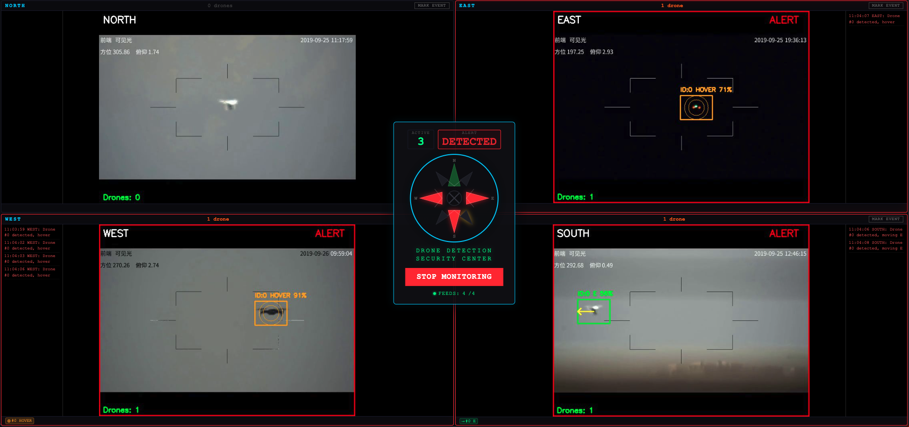

# drone-detection-demo
This demo shows how a theoretical simplified model of centrally-monitored drone detection cameras could work for security operators even with imperfect coverage, maintaining situational awareness while trading off costs of additional camera deployment and monitoring. Vibe coded with Claude!

